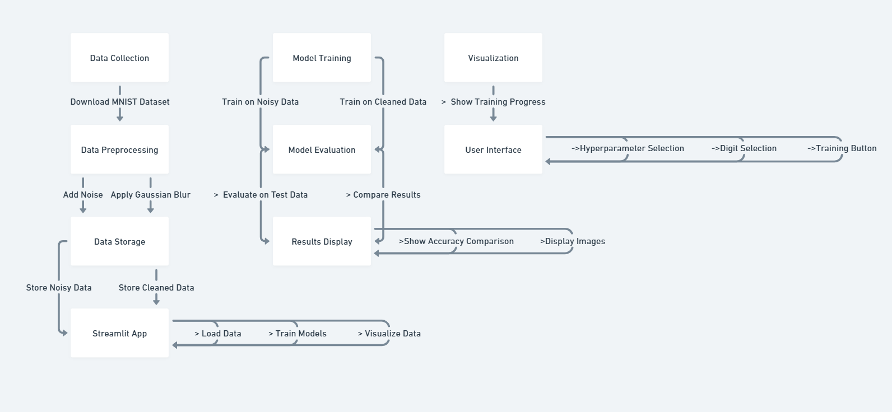
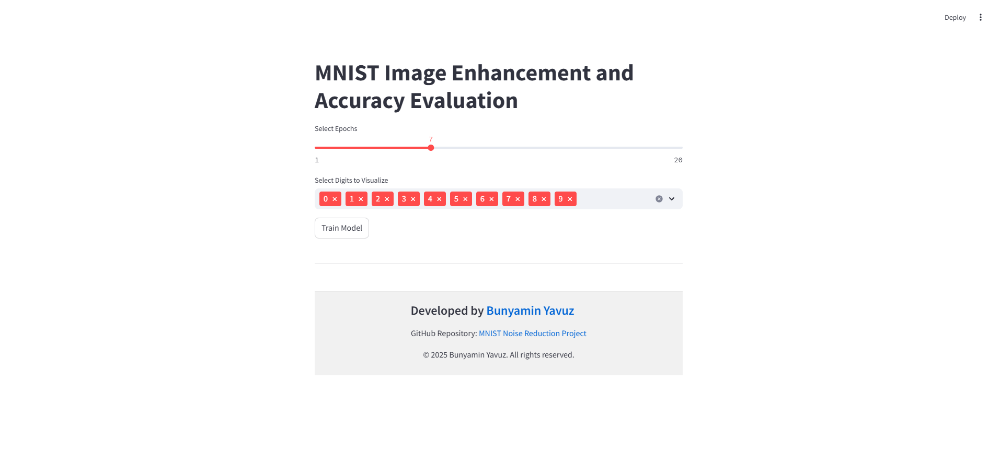
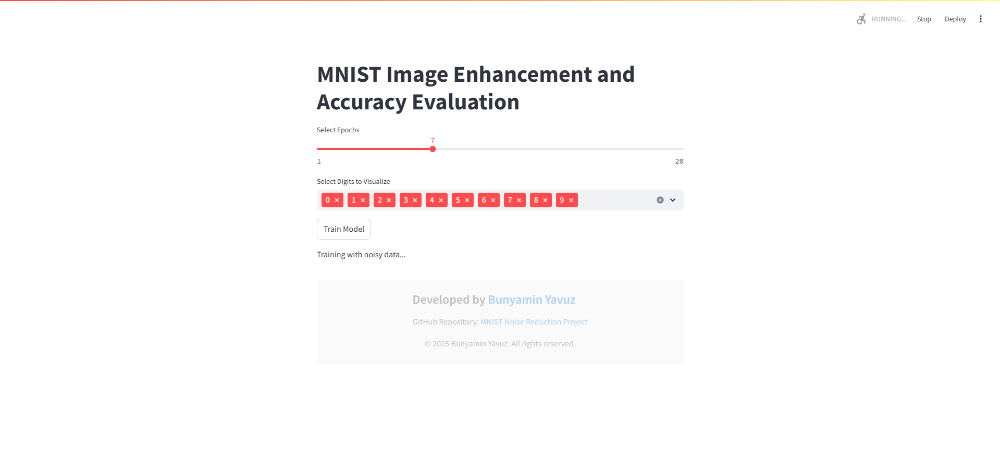
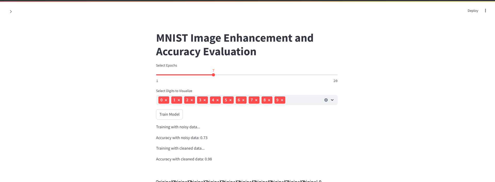
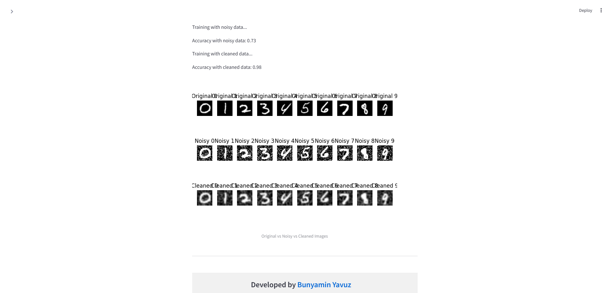

# MNIST Image Enhancement and Accuracy Evaluation

This project demonstrates the effects of noise on MNIST digit classification and the improvements achieved using denoising techniques.

## Project Overview
This project applies Gaussian blur to noisy MNIST images and trains models to classify the digits. It compares the performance of models trained on noisy data versus cleaned data.

## Project Structure
- **data/**: Contains scripts for downloading and preprocessing data.
- **models/**: Includes modules for training models and storing trained models.
- **notebooks/**: Interactive Jupyter notebooks.
- **results/**: Stores output plots and results.
- **utils/**: Utility scripts for preprocessing and visualization.

## System Architecture


## Prerequisites
- Python 3.x
- Install dependencies:
  ```bash
  pip install -r requirements.txt
  ```

## How to Run

1. **Download Data**:
   ```bash
   python data/download_mnist.py
   ```

2. **Train and Evaluate Models**:
   ```bash
   python models/train_model.py
   ```

3. **Run the Streamlit App**:  
   Start the Streamlit app to visualize and experiment with the project:
   ```bash
   streamlit run streamlit_app.py
   ```

---

## Usage

### 1. Run the Streamlit App
To start the Streamlit app, run the following command:
```bash
streamlit run streamlit_app.py
```

### 2. Select Hyperparameters
- Use the **slider** to select the number of epochs for training the models.
- Use the **multiselect widget** to choose which digits to visualize.



### 3. Train the Models
- Click the "Train Model" button to start training the models with both noisy and cleaned data.
- The app will display the training progress and accuracy for both models.



### 4. View Results
- The sidebar will show the accuracy of the models trained on noisy and cleaned data.
- The main page will display a comparison image showing the original, noisy, and cleaned versions of the selected digits.



### 5. Interpret the Outputs
- Compare the accuracy of the models trained on noisy and cleaned data to understand the impact of denoising.
- Use the comparison image to visually inspect the effects of noise and denoising on the MNIST digits.



---

## Results
The project demonstrates:
- Comparison of model performance on noisy and cleaned data.
- Visualizations to highlight the effects of noise reduction.

---

## Contributing

Contributions are welcome! Follow these steps to contribute:

1. **Fork the Repository**:  
   Click the "Fork" button at the top right of this repository to create a copy under your GitHub account.

2. **Clone Your Fork**:  
   Clone the forked repository to your local machine:
   ```bash
   git clone https://github.com/BunyaminYavuz/MNISTimageEnhancementAndAccuracyEvaluation.git
   ```

3. **Create a New Branch**:  
   Create a branch for your feature or fix:
   ```bash
   git checkout -b feature-or-fix-name
   ```

4. **Make Your Changes**:  
   Implement your changes and test them locally.

5. **Commit Your Changes**:  
   Write clear and concise commit messages:
   ```bash
   git add .
   git commit -m "Add description of your changes"
   ```

6. **Push to GitHub**:  
   Push your branch to your forked repository:
   ```bash
   git push origin feature-or-fix-name
   ```

7. **Submit a Pull Request**:  
   Open a pull request to the main repository with a description of your changes.

---

## License
This project is licensed under the MIT License. See the [LICENSE](LICENSE) file for details.
